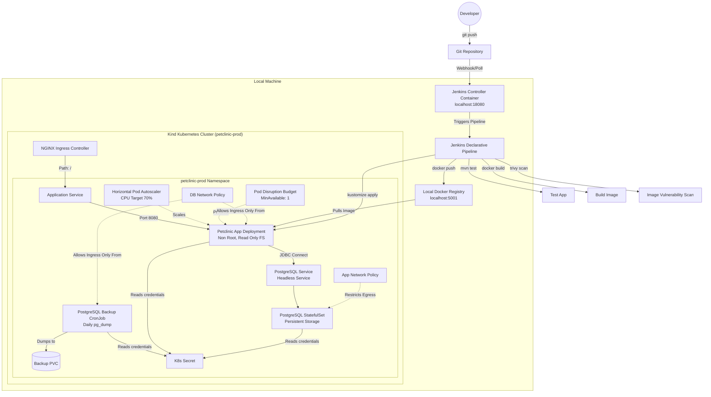

# DevOps Case Study: Spring Petclinic on Kubernetes

This repository contains the infrastructure, deployment configurations, and automation scripts to run the classic **Spring Petclinic** Java application on a local Kubernetes (Kind) cluster. 

The main goal here is to demonstrate standard DevOps practices: secure containerization, local cluster orchestration with registry, declarative k8s setups using Kustomize, scheduled DB backups, and a Jenkins CI/CD pipeline.

*For the Turkish version of this guide, please check [README[TR].md](./README[TR].md).*

---

## Architectural Overview

This system is set up for local development and validation using **Kind (Kubernetes In Docker)** with a local registry, simulating a standard cloud environment.



---

## Repository Structure

Below is the directory structure:

```text
.
├── .dockerignore                 # Excludes local environments and DevOps configs from Docker context
├── .gitignore                    # Ensures secrets and build outputs are never committed
├── Jenkinsfile                   # CI CD Pipeline
├── app/
│   └── spring-petclinic/         # Main Spring Boot Application Source Code
├── docker/
│   └── Dockerfile                # Multi stage, secure JRE Dockerfile
├── compose/
│   ├── docker-compose.yml        # Docker compose configuration for local runs using Secrets
│   └── jenkins-controller.yml    # Runs Jenkins Controller for CI CD tasks
├── k8s/
│   ├── kind-cluster.yaml         # Custom Kind configuration with Ingress and Port Mapping
│   └── base/                     # Declarative Kubernetes Manifests (Kustomize Base)
│       ├── namespace.yaml        # Prod namespace enforcing Pod Security Standards
│       ├── kustomization.yaml    # Declarative composition of resources
│       ├── resourcequota.yaml    # Resource bounds per namespace
│       ├── limitrange.yaml       # Default request and limits allocations for containers
│       ├── configmap.yaml        # Application configurations
│       ├── app-deployment.yaml   # Hardened application deployment
│       ├── app-service.yaml      # Service exposing the app
│       ├── app-ingress.yaml      # Ingress rules routing / to the service
│       ├── app-hpa.yaml          # Horizontal Pod Autoscaler for traffic scaling
│       ├── app-pdb.yaml          # PodDisruptionBudget ensuring availability
│       ├── app-networkpolicy.yaml# Limits app pod communications
│       ├── postgres-service.yaml # Headless service for DB
│       ├── postgres-statefulset.yaml # Database StatefulSet
│       ├── postgres-networkpolicy.yaml # Restricts DB ingress to app and backup
│       ├── postgres-backup-pvc.yaml # Storage volume for database backups
│       └── postgres-backup-cronjob.yaml # CronJob executing daily backups
└── scripts/                      # Automation PowerShell scripts  
    ├── init-secrets.ps1          # Locally generates random credentials
    ├── create-cluster.ps1        # Kind cluster setup
    ├── create-cluster-with-registry.ps1 # Sets up Kind cluster and connects local registry
    ├── install-ingress.ps1       # Installs NGINX Ingress Controller
    ├── install-metrics-server.ps1# Installs and configures Kubernetes Metrics Server
    ├── build-image.ps1           # Builds and pushes the Docker image
    ├── deploy-k8s.ps1            # Automates secret management and deploys resources
    └── destroy-k8s.ps1           # Cleanup utility
```

---

## Technical Features

### 1. Docker Configuration
* **Multi Stage Builds:** Minimizes image size and eliminates compile-time overhead inside production. Build stage uses JDK 21, runtime stage uses lightweight JRE 21.
* **Reproducible Baseline:** Base images are pinned to Ubuntu-based Jammy versions (`eclipse-temurin:21-jdk-jammy` and `eclipse-temurin:21-jre-jammy`).
* **Minimal Layers:** Merged sequential commands (`RUN chmod +x ... && ./mvnw ...`) to reduce image layer count and optimize caching.
* **Non-Root Security:** Custom user and group (`petclinic` with UID/GID `10001`) are configured. The app runs completely non-root to prevent container breakout exploits.

### 2. Kubernetes Architecture
* **Pod Security Standards (PSS):** Enforces `baseline` security policies and audits `restricted` rules at the namespace level.
* **Security Context Hardening:** Application containers feature a read-only root filesystem (`readOnlyRootFilesystem: true`), dropped Linux capabilities (`ALL`), blocked privilege escalation, and runtime default seccomp profile configuration.
* **Database Reliability:** PostgreSQL is deployed via a `StatefulSet` with robust `readiness` and `liveness` probes executing standard `pg_isready` checks using file-based secrets.
* **Zero Downtime Releases:** Rolling update strategy guarantees continuous uptime during releases (`maxUnavailable: 0` and `maxSurge: 1`).
* **Self Healing Probes:** Integrates startup, readiness, and liveness probes to monitor Spring Boot startup and container health, restarting failed pods automatically.
* **Resource Governance:** Guarantees CPU and memory limits (`requests` and `limits`) to ensure performance stability.
* **Scaling and High Availability:** 
    * **Horizontal Pod Autoscaler (HPA)** automatically scales application k8s replicas dynamically up to 3 when CPU utilization crosses 70%.
    * **Pod Disruption Budget (PDB)** prevents maintenance operations from bringing down all app k8s replicas at once (`minAvailable: 1`).
* **Zero Trust Networking:** strict `NetworkPolicies` isolate traffic:
    * PostgreSQL pods accept connection **ONLY** from the application pods and the backup job.
    * Application pods can only communicate with the DB service and the cluster DNS.
* **Scheduled Backups:** A native `CronJob` runs daily at 2:00 AM. It safely executes a `pg_dump` of the database using a headless structure and mounts it to a dedicated PersistentVolumeClaim (PVC).

### 3. GitOps and Secrets Security
* **Secrets Configuration:** Application and DB are configured using file-based config trees and secrets. No raw passwords or JDBC strings are hardcoded in the manifests.
* **Automated Generation:** Local PowerShell scripts create secure, random, gitignored credentials.

### 4. Automated CI CD (Jenkins)
* **Integrity Assurance:** The pipeline automatically tests the codebase using the Maven wrapper before building.
* **Image Scanning:** Integrates **Trivy** to scan the freshly built docker images for HIGH and CRITICAL vulnerabilities, generating a scan report.
* **Declarative Infrastructure:** Optional platform step dynamically updates the local cluster configurations, installing the Nginx Ingress controller and Metrics Server.
* **Rollout Verification:** Once deployed, the pipeline runs automated validation routines waiting for rollouts and prints the live status of the deployment.

---

## Local Setup and Deployment Guide

Follow these instructions on a Windows machine (with PowerShell and Docker Desktop running) to set up and run the entire ecosystem locally.

### Prerequisites
* [Docker Desktop](https://www.docker.com/products/docker-desktop/) (configured to run Linux containers)
* [Kind CLI](https://kind.sigs.k8s.io/)
* [Kubectl CLI](https://kubernetes.io/docs/tasks/tools/)
* PowerShell 7+ (Recommended)

### 🚀 Option A: Fast Track (One Click Setup - Recommended)
You can provision the entire local cluster, configure security settings, compile the application, deploy all resources to Kubernetes, and optionally start Jenkins using a single master bootstrap script at the root of the repository:
```powershell
.\start-all.ps1
```
This script handles all steps automatically, validates deployment states, and prints active access URLs when completed.

### 📋 Option B: Step by Step Local Deployment
If you prefer to set up the infrastructure and deploy resources manually step by step, follow the instructions below:

### Step 1: Initialize Local Secrets
Run the script to generate secure database credentials locally:
```powershell
.\scripts\init-secrets.ps1
```
This creates a gitignored `secrets/` directory filled with randomly generated passwords and config files.

### Step 2: Provision Kind Kubernetes Cluster with Local Registry
Boot up the cluster and registry in tandem:
```powershell
.\scripts\create-cluster-with-registry.ps1
```
This configures a custom Kind cluster mapping ports 80 -> 8080 and 443 -> 8443 on your local machine, and connects it to a local registry container running on `localhost:5001`.

### Step 3: Install Platform Add-ons
Install the **NGINX Ingress Controller** and **Metrics Server** (required for HPA to pull resource utilization statistics):
```powershell
# Install Ingress Controller
.\scripts\install-ingress.ps1

# Install Metrics Server (specifically patched for Kind)
.\scripts\install-metrics-server.ps1
```

### Step 4: Build and Push Docker Image
Trigger the multi-stage Maven build and push the image to your local registry:
```powershell
.\scripts\build-image.ps1
```

### Step 5: Deploy to Kubernetes
Apply the configurations and wait for deployments to stabilize:
```powershell
.\scripts\deploy-k8s.ps1
```
This validates secrets, mounts them as a K8s secret, deploys the resources using Kustomize, and awaits rollout. It will print the ready status once successfully completed.

---

## CI CD with Jenkins

This repository includes a pre-configured local **Jenkins Controller** to automate the build, test, security scan, and Kubernetes deployment workflows.

### 1. Launching the Jenkins Controller
You can automatically start the Jenkins server, wait for it to become ready, and retrieve the initial admin password using the provided PowerShell script:
```powershell
.\scripts\start-jenkins.ps1
```
This script handles creating the persistent directory at `C:/jenkins-home` to keep your credentials and jobs safe, starting the container using Docker Compose, querying the local endpoint until Jenkins is up, and printing the initial admin password.

Alternatively, you can stop the Jenkins server at any time using:
```powershell
.\scripts\stop-jenkins.ps1
```

If you prefer manual execution, you can run the Docker Compose commands directly:
```bash
docker compose -f compose/jenkins-controller.yml up -d
```
Jenkins will be accessible in your browser at: [http://localhost:18080](http://localhost:18080)

### 2. Pipeline Configuration Prerequisites
To run the declarative `Jenkinsfile` successfully:
1. **Configure a Jenkins Agent:** The pipeline requires a Jenkins agent labeled `windows-docker` configured on your machine with Docker, Java, Maven, Trivy, and Kind CLIs installed. You can automatically start this agent and connect it to the Jenkins controller using the provided script:
    ```powershell
    .\scripts\start-jenkins-agent.ps1
    ```
    On the first run, the script will prompt you for your agent's unique Secret Key (copied from the Jenkins UI) and save it securely in `secrets/jenkins-agent.secret` (gitignored). Subsequent executions will boot up the agent completely automatically.
2. **Add Credentials:** Inside the Jenkins UI under Credentials (`Manage Jenkins` -> `Credentials`), add the following String variables to securely provide parameters for the deployment:
    * `petclinic-postgres-db` (Value e.g., `petclinic`)
    * `petclinic-postgres-user` (Value e.g., `petclinic_app`)
    * `petclinic-postgres-password` (Value e.g., your secure database password generated in `secrets/postgres.password`)

### 3. Pipeline Stages Executed
When a run is triggered, the pipeline processes the following steps:
1. **Tool Check:** Verifies CLI versions (Docker, Kubectl, Kind, Trivy, Java, Git).
2. **Setup Platform Add-ons:** (Optional, toggled via `RUN_PLATFORM_SETUP` parameter) Installs/updates Ingress Controller and Metrics Server.
3. **Test Application:** Runs unit and integration tests (`mvnw clean test -B`).
4. **Build Docker Image:** Compiles the application and builds the multi stage docker image.
5. **Scan Image (Trivy):** Scans the image for HIGH/CRITICAL CVEs and writes `trivy-image-scan.txt`.
6. **Push Image:** Publishes the image to the local Kind accessible registry.
7. **Validate Manifests:** Validates dry run configurations using Kustomize, exporting `rendered-manifests.yaml`.
8. **Deploy to Kubernetes:** Securely builds K8s Secrets on the agent, applies all k8s resources, and patches the deployment image.
9. **Verify Rollout:** Ensures both the app and database workloads successfully roll out in the cluster.
10. **Archive Artifacts:** Saves the `rendered-manifests.yaml` and `trivy-image-scan.txt` inside Jenkins build history.

---

## Accessing the Application

Once step 5 completes successfully, you can access the running **Spring Petclinic** application in your browser:

* **Via Ingress (Recommended):** [http://localhost:8080](http://localhost:8080)
* **Via Direct NodePort:** [http://localhost:8080](http://localhost:8080) (Port 80 inside K8s is routed to port 8080 on the host machine).

---

## Tear down (Cleanup)

To clean up resources and release CPU/RAM on your local machine:

1. **Delete namespace and resources (keeps cluster):**
   ```powershell
   .\scripts\destroy-k8s.ps1
   ```
2. **Delete the Kind cluster and all data completely:**
   ```powershell
   .\scripts\destroy-k8s.ps1 -DeleteCluster
   ```
