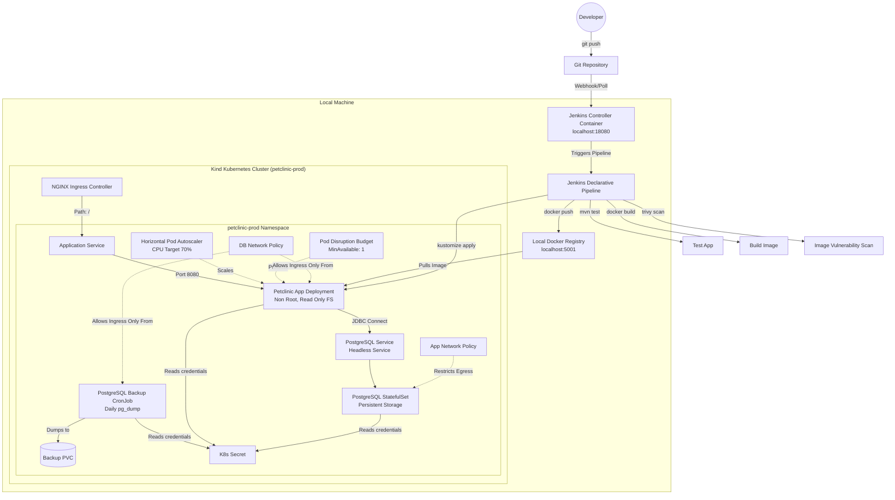

# DevOps Case Study: Spring Petclinic on Kubernetes

Welcome to the **DevOps Case Study** repository. This project deploys the classic **Spring Petclinic** Java application on a Kubernetes cluster. 

The goal of this case study is to demonstrate DevOps workflows, including containerization, local cluster setup, Kustomize configuration, database operations, and a CI CD pipeline using Jenkins.

## Architectural Overview

This system is set up for local development and validation using **Kind (Kubernetes In Docker)** with a local registry, simulating a standard cloud environment.



## Repository Structure

Below is the directory structure:

```text
.
├── .dockerignore                 # Excludes local environments and DevOps configs from Docker context
├── .gitignore                    # Ensures secrets and build outputs are never committed
├── Jenkinsfile                   # CI CD Pipeline
├── app/
│   └── spring-petclinic/         # Main Spring Boot Application Source Code
├── docker/
│   └── Dockerfile                # Multi stage, secure JRE Dockerfile
├── compose/
│   ├── docker-compose.yml        # Docker compose configuration for local runs using Secrets
│   └── jenkins-controller.yml    # Runs Jenkins Controller for CI CD tasks
├── k8s/
│   ├── kind-cluster.yaml         # Custom Kind configuration with Ingress and Port Mapping
│   └── base/                     # Declarative Kubernetes Manifests (Kustomize Base)
│       ├── namespace.yaml        # Prod namespace enforcing Pod Security Standards
│       ├── kustomization.yaml    # Declarative composition of resources
│       ├── resourcequota.yaml    # Resource bounds per namespace
│       ├── limitrange.yaml       # Default request and limits allocations for containers
│       ├── configmap.yaml        # Application configurations
│       ├── app-deployment.yaml   # Hardened application deployment
│       ├── app-service.yaml      # Service exposing the app
│       ├── app-ingress.yaml      # Ingress rules routing / to the service
│       ├── app-hpa.yaml          # Horizontal Pod Autoscaler for traffic scaling
│       ├── app-pdb.yaml          # PodDisruptionBudget ensuring availability
│       ├── app-networkpolicy.yaml# Limits app pod communications
│       ├── postgres-service.yaml # Headless service for DB
│       ├── postgres-statefulset.yaml # Database StatefulSet
│       ├── postgres-networkpolicy.yaml # Restricts DB ingress to app and backup
│       ├── postgres-backup-pvc.yaml # Storage volume for database backups
│       └── postgres-backup-cronjob.yaml # CronJob executing daily backups
└── scripts/                      # Automation PowerShell scripts  
    ├── init-secrets.ps1          # Locally generates random credentials
    ├── create-cluster.ps1        # Kind cluster setup
    ├── create-cluster-with-registry.ps1 # Sets up Kind cluster and connects local registry
    ├── install-ingress.ps1       # Installs NGINX Ingress Controller
    ├── install-metrics-server.ps1# Installs and configures Kubernetes Metrics Server
    ├── build-image.ps1           # Builds and pushes the Docker image
    ├── deploy-k8s.ps1            # Automates secret management and deploys resources
    └── destroy-k8s.ps1           # Cleanup utility
```

## Technical Features

### 1. Docker Configuration
*   **Multi Stage Builds:** Minimizes image size and eliminates compile time overhead inside production. Build stage uses JDK 21, runtime stage uses lightweight JRE 21.
*   **Reproducible Baseline:** Base images are pinned to Ubuntu based Jammy versions (`eclipse-temurin:21-jdk-jammy` and `eclipse-temurin:21-jre-jammy`).
*   **Minimal Layers:** Merged sequential commands (`RUN chmod +x ... && ./mvnw ...`) to reduce image layer count and optimize caching.
*   **Non Root Security:** Custom user and group (`petclinic` with UID GID `10001`) are configured. The app runs completely non root to prevent container breakout exploits.

### 2. Kubernetes Architecture
*   **Pod Security Standards (PSS):** Enforces `baseline` security policies and audits `restricted` rules at the namespace level.
*   **Security Context Hardening (app-deployment.yaml lines 27 to 31 and 82 to 96):** Application containers feature a read only root filesystem (`readOnlyRootFilesystem: true`), dropped Linux capabilities (`ALL`), blocked privilege escalation, and runtime default seccomp profile configuration.
*   **Database Reliability:** PostgreSQL is deployed via a `StatefulSet` with robust `readiness` and `liveness` probes executing standard `pg_isready` checks using file based secrets.
*   **Zero Downtime Releases (app-deployment.yaml lines 12 to 16):** Rolling update strategy guarantees continuous uptime during releases (`maxUnavailable: 0` and `maxSurge: 1`).
*   **Self Healing Probes (app-deployment.yaml lines 53 to 74):** Integrates startup, readiness, and liveness probes to monitor Spring Boot startup and container health, restarting failed pods automatically.
*   **Resource Governance (app-deployment.yaml lines 75 to 81):** Guarantees CPU and memory limits (`requests` and `limits`) to ensure performance stability.
*   **Scaling and High Availability:** 
    *   **Horizontal Pod Autoscaler (HPA)** automatically scales application k8s replicas dynamically up to 3 when CPU utilization crosses 70%.
    *   **Pod Disruption Budget (PDB)** prevents maintenance operations from bringing down all app k8s replicas at once (`minAvailable: 1`).
*   **Zero Trust Networking:** strict `NetworkPolicies` isolate traffic:
    *   PostgreSQL pods accept connection **ONLY** from the application pods and the backup job.
    *   Application pods can only communicate with the DB service and the cluster DNS.
*   **Scheduled Backups:** A native `CronJob` runs daily at 2:00 AM. It safely executes a `pg_dump` of the database using a headless structure and mounts it to a dedicated PersistentVolumeClaim (PVC).

### 3. GitOps and Secrets Security
*   **Secrets Configuration:** Application and DB are configured using file based config trees and secrets. No raw passwords or JDBC strings are hardcoded in the manifests.
*   **Automated Generation:** Local PowerShell scripts create secure, random, gitignored credentials.

### 4. Automated CI CD (Jenkins)
*   **Integrity Assurance:** The pipeline automatically tests the codebase using the Maven wrapper before building.
*   **Image Scanning:** Integrates **Trivy** to scan the freshly built docker images for HIGH and CRITICAL vulnerabilities, generating a scan report.
*   **Declarative Infrastructure:** Optional platform step dynamically updates the local cluster configurations, installing the Nginx Ingress controller and Metrics Server.
*   **Rollout Verification:** Once deployed, the pipeline runs automated validation routines waiting for rollouts and prints the live status of the deployment.

## Step by Step Local Deployment Guide

Follow these steps on a Windows machine (with PowerShell and Docker Desktop running) to set up and run the entire ecosystem locally.

### Prerequisites
*   [Docker Desktop](https://www.docker.com/products/docker-desktop/) (configured to run Linux containers)
*   [Kind CLI](https://kind.sigs.k8s.io/)
*   [Kubectl CLI](https://kubernetes.io/docs/tasks/tools/)
*   PowerShell 7+ (Recommended)

### Step 1: Initialize Local Secrets
Run the script to generate secure database credentials locally:
```powershell
.\scripts\init-secrets.ps1
```
This creates a gitignored `secrets/` directory filled with randomly generated passwords and config files.

### Step 2: Provision Kind Kubernetes Cluster with Local Registry
Boot up the cluster and registry in tandem:
```powershell
.\scripts\create-cluster-with-registry.ps1
```
This configures a custom Kind cluster mapping ports 80 -> 8080 and 443 -> 8443 on your local machine, and connects it to a local registry container running on `localhost:5001`.

### Step 3: Install Platform Add ons
Install the **NGINX Ingress Controller** and **Metrics Server** (required for HPA to pull resource utilization statistics):
```powershell
# Install Ingress Controller
.\scripts\install-ingress.ps1

# Install Metrics Server (specifically patched for Kind)
.\scripts\install-metrics-server.ps1
```

### Step 4: Build and Push Docker Image
Trigger the multi stage Maven build and push the image to your local registry:
```powershell
.\scripts\build-image.ps1
```

### Step 5: Deploy to Kubernetes
Apply the configurations and wait for deployments to stabilize:
```powershell
.\scripts\deploy-k8s.ps1
```
This validates secrets, mounts them as a K8s secret, deploys the resources using Kustomize, and awaits rollout. It will print the ready status once successfully completed.

## CI CD with Jenkins

This repository includes a pre configured local **Jenkins Controller** to automate the build, test, security scan, and Kubernetes deployment workflows.

### 1. Launching the Jenkins Controller
You can automatically start the Jenkins server, wait for it to become ready, and retrieve the initial admin password using the provided PowerShell script:
```powershell
.\scripts\start-jenkins.ps1
```
This script handles creating the persistent directory at `C:/jenkins-home` to keep your credentials and jobs safe, starting the container using Docker Compose, querying the local endpoint until Jenkins is up, and printing the initial admin password.

Alternatively, you can stop the Jenkins server at any time using:
```powershell
.\scripts\stop-jenkins.ps1
```

If you prefer manual execution, you can run the Docker Compose commands directly:
```bash
docker compose -f compose/jenkins-controller.yml up -d
```
Jenkins will be accessible in your browser at: [http://localhost:18080](http://localhost:18080)

### 2. Pipeline Configuration Prerequisites
To run the declarative `Jenkinsfile` successfully:
1.  **Configure a Jenkins Agent:** The pipeline requires a Jenkins agent labeled `windows-docker` configured on your machine with Docker, Java, Maven, Trivy, and Kind CLIs installed. You can automatically start this agent and connect it to the Jenkins controller using the provided script:
    ```powershell
    .\scripts\start-jenkins-agent.ps1
    ```
    On the first run, the script will prompt you for your agent's unique Secret Key (copied from the Jenkins UI) and save it securely in `secrets/jenkins-agent.secret` (gitignored). Subsequent executions will boot up the agent completely automatically.
2.  **Add Credentials:** Inside the Jenkins UI under Credentials (`Manage Jenkins` -> `Credentials`), add the following String variables to securely provide parameters for the deployment:
    *   `petclinic-postgres-db` (Value e.g., `petclinic`)
    *   `petclinic-postgres-user` (Value e.g., `petclinic_app`)
    *   `petclinic-postgres-password` (Value e.g., your secure database password generated in `secrets/postgres.password`)

### 3. Pipeline Stages Executed
When a run is triggered, the pipeline processes the following steps:
1.  **Tool Check:** Verifies CLI versions (Docker, Kubectl, Kind, Trivy, Java, Git).
2.  **Setup Platform Add ons:** (Optional, toggled via `RUN_PLATFORM_SETUP` parameter) Installs/updates Ingress Controller and Metrics Server.
3.  **Test Application:** Runs unit and integration tests (`mvnw clean test -B`).
4.  **Build Docker Image:** Compiles the application and builds the multi stage docker image.
5.  **Scan Image (Trivy):** Scans the image for HIGH/CRITICAL CVEs and writes `trivy-image-scan.txt`.
6.  **Push Image:** Publishes the image to the local Kind accessible registry.
7.  **Validate Manifests:** Validates dry run configurations using Kustomize, exporting `rendered-manifests.yaml`.
8.  **Deploy to Kubernetes:** Securely builds K8s Secrets on the agent, applies all k8s resources, and patches the deployment image.
9.  **Verify Rollout:** Ensures both the app and database workloads successfully roll out in the cluster.
10. **Archive Artifacts:** Saves the `rendered-manifests.yaml` and `trivy-image-scan.txt` inside Jenkins build history.

## Accessing the Application

Once step 5 completes successfully, you can access the running **Spring Petclinic** application in your browser:

*   **Via Ingress (Recommended):** [http://localhost:8080](http://localhost:8080)
*   **Via Direct NodePort:** [http://localhost:8080](http://localhost:8080) (Port 80 inside K8s is routed to port 8080 on the host machine).

## Tear down (Cleanup)

To clean up resources and release CPU/RAM on your local machine:

1. **Delete namespace and resources (keeps cluster):**
   ```powershell
   .\scripts\destroy-k8s.ps1
   ```
2. **Delete the Kind cluster and all data completely:**
   ```powershell
   .\scripts\destroy-k8s.ps1 -DeleteCluster
   ```

# DevOps Örnek Çalışması: Kubernetes Üzerinde Spring Petclinic

DevOps Örnek Çalışması deposuna hoş geldiniz. Bu proje, klasik Spring Petclinic Java uygulamasını bir Kubernetes kümesinde çalıştırmak üzere tasarlanmış altyapıyı barındırır.

Bu çalışmanın amacı konteyner tasarımı, yerel küme kurulumu, Kustomize yönetimi, otomatik veritabanı yedekleme süreçleri ve Jenkins ile CI CD süreçlerini göstermektir.

## Teknik Özellikler

### 1. Docker Yapılandırması
*   **Çok Aşamalı Yapı (Multi Stage Build):** Derleme bağımlılıklarını nihai paketten uzak tutarak imaj boyutunu küçültür. Derleme aşamasında JDK 21, runtime aşamasında ise hafif JRE 21 kullanılır.
*   **Kararlı ve Sabit Altyapı:** Temel imajlar, tutarlı derleme garantisi sağlamak için Ubuntu tabanlı Jammy versiyonlarına sabitlenmiştir (`eclipse-temurin:21-jdk-jammy` ve `eclipse-temurin:21-jre-jammy`).
*   **Katman Optimizasyonu:** Ardışık komutlar tek satırda birleştirilerek (`RUN chmod +x ... && ./mvnw ...`) gereksiz katman oluşumu engellenmiş ve önbellek performansı artırılmıştır.
*   **Yetkisiz Çalıştırma (Non Root Security):** Konteyner içerisinde özel yetkisiz kullanıcı ve grup (`petclinic` UID GID `10001`) tanımlanmıştır. Uygulama yetkisiz kullanıcı ile çalışarak güvenlik risklerini engeller.

### 2. Kubernetes Mimarisi
*   **Pod Güvenlik Standartları (PSS):** Namespace düzeyinde `baseline` güvenlik politikaları zorunlu kılınmış, `restricted` kuralları denetlenmiştir.
*   **Sıkılaştırılmış Güvenlik Yetkileri (app-deployment.yaml 27 - 31 ve 82 - 96. satırlar):** Uygulama podlarında salt okunur kök dosya sistemi (`readOnlyRootFilesystem: true`), Linux çekirdek yetkilerinin kaldırılması (`drop: [ALL]`), ayrıcalık yükseltme engeli ve varsayılan çalışma zamanı seccomp profili uygulanmıştır.
*   **Dayanıklı Veritabanı:** PostgreSQL, `StatefulSet` mimarisi ile kalıcı depolama birimi kullanılarak dağıtılmıştır. Sağlık durumu dosya tabanlı şifrelerle `pg_isready` aracıyla sürekli denetlenir.
*   **Kesintisiz Güncelleme (app-deployment.yaml 12 - 16. satırlar):** Güncellemelerde uygulama kesintisi sıfıra indirgenmiştir (`maxUnavailable: 0` ve `maxSurge: 1`).
*   **Kendi Kendini İyileştirme (app-deployment.yaml 53 - 74. satırlar):** Konteyner sağlığını izleyen startup, readiness ve liveness probelarını barındırır. Arızalı podları otomatik olarak yeniden başlatır.
*   **Kaynak Yönetimi (app-deployment.yaml 75 - 81. satırlar):** Uygulamanın performansını garanti eden ve sunucuyu yormayan işlemci ve bellek sınırlarını (`requests` ve `limits`) tanımlar.
*   **Ölçekleme ve Yüksek Erişilebilirlik:**
    *   **Yatay Pod Otomatik Ölçekleyici (HPA)**, CPU kullanımı %70'i aştığında pod kopyalarını otomatik olarak 3 adede kadar dinamik ölçekler.
    *   **Pod Kesinti Bütçesi (PDB)**, bakım süreçlerinde uygulamanın en az 1 kopyasının sürekli ayakta kalmasını garanti eder.
*   **Sıfır Güven Ağ Politikaları (NetworkPolicies):** Ağ trafiği katı kurallarla izole edilmiştir:
    *   PostgreSQL podları yalnızca uygulama podlarından ve yedekleme işinden gelen bağlantıları kabul eder.
    *   Uygulama podları yalnızca DB servisi ve küme içi DNS ile konuşabilir.
*   **Zamanlanmış Veritabanı Yedekleme:** Her gün sabaha karşı 02:00'de çalışan bir `CronJob` veritabanının yedeğini (`pg_dump`) otomatik olarak alır ve bunu kalıcı bir disk birimine (PVC) kaydeder.

### 3. GitOps ve Güvenli Şifre Yönetimi
*   **Secrets Yapılandırması:** Uygulama ve veritabanı şifreleri Kubernetes Secret'ları üzerinden güvenli olarak enjekte edilir. Kodlarda veya manifest dosyalarda hiçbir şifre veya bağlantı dizesi açıkta bulunmaz.
*   **Otomatik Üretim:** Yerel PowerShell scriptleri ile git tarafından takip edilmeyen, rastgele şifreler üretilir.

### 4. Otomatik CI CD (Jenkins Pipeline)
*   **Derleme Testleri:** Pipeline, herhangi bir build işlemine başlamadan önce Maven aracılığıyla uygulamanın birim testlerini çalıştırarak kod bütünlüğünü doğrular.
*   **Güvenlik Taraması (Trivy Scan):** Derlenen Docker imajları, **Trivy** entegrasyonu sayesinde HIGH ve CRITICAL düzeydeki zafiyetler için otomatik taranır ve raporlanır.
*   **Otomatik Küme Hazırlığı:** Opsiyonel bir parametre ile küme düzeyindeki Ingress Controller ve Metrics Server bileşenleri pipeline esnasında kurulup güncellenebilir.
*   **Dağıtım Doğrulama:** Dağıtım sonrasında, dağıtımın başarıyla tamamlandığı doğrulanana kadar beklenir ve kümedeki tüm kaynakların güncel durumu ekrana basılır.

## Adım Adım Yerel Dağıtım Kılavuzu

PowerShell ve Docker Desktop yüklü bir Windows bilgisayarda projeyi yerel olarak ayağa kaldırmak için aşağıdaki adımları sırasıyla uygulayın:

### Gereksinimler
*   [Docker Desktop](https://www.docker.com/products/docker-desktop/) (Linux konteyner modunda aktif)
*   [Kind CLI](https://kind.sigs.k8s.io/)
*   [Kubectl CLI](https://kubernetes.io/docs/tasks/tools/)
*   PowerShell 7+ (Önerilen)

### Adım 1: Yerel Şifreleri Oluşturun
Rastgele ve güvenli veritabanı kimlik bilgilerini oluşturmak için betiği çalıştırın:
```powershell
.\scripts\init-secrets.ps1
```
Bu komut, repo dışında tutulan `secrets/` klasörünü oluşturur ve içerisine rastgele şifreler kaydeder.

### Adım 2: Yerel Kayıt Defteri ile Kind Kubernetes Kümesini Kurun
Küme ve yerel Docker kayıt defterini (registry) birlikte başlatın:
```powershell
.\scripts\create-cluster-with-registry.ps1
```
Bu betik, local makinenizde 80->8080 ve 443->8443 port eşlemelerine sahip bir Kubernetes kümesi kurar ve onu `localhost:5001` adresinde çalışan Docker kayıt defterine bağlar.

### Adım 3: Küme Eklentilerini Yükleyin
HPA'in çalışması için gerekli olan **Metrics Server** ve dış ağ erişimi sağlayan **NGINX Ingress Controller** eklentilerini kurun:
```powershell
# Ingress Controller Kurulumu
.\scripts\install-ingress.ps1

# Metrics Server Kurulumu (Kind kümesi için yamalanmış versiyon)
.\scripts\install-metrics-server.ps1
```

### Adım 4: Docker İmajını Derleyin ve Local Registry'ye Gönderin
Çok aşamalı Maven derleme işlemini tetikleyin ve derlenen imajı yerel kayıt defterine yükleyin:
```powershell
.\scripts\build-image.ps1
```

### Adım 5: Kubernetes'e Dağıtımı Gerçekleştirin
Şifreleri Kubernetes Secret'ı olarak yükleyin, kustomize ile tüm kaynakları dağıtın ve podların hazır hale gelmesini bekleyin:
```powershell
.\scripts\deploy-k8s.ps1
```
Bu işlem tamamlandığında kümede çalışan tüm kaynaklar ve durumları PowerShell konsolunda listelenecektir.

## Jenkins ile CI CD (Sürekli Entegrasyon & Dağıtım)

Bu depoda; derleme, test, güvenlik taraması ve Kubernetes dağıtım süreçlerini tamamen otomatize etmek üzere önceden yapılandırılmış bir **Jenkins Controller** yer almaktadır.

### 1. Jenkins Controller'ı Başlatma
Jenkins sunucusunu otomatik olarak başlatmak, hazır olmasını beklemek ve ilk yönetici (admin) şifresini otomatik olarak ekrana yazdırmak için hazırlanan PowerShell betiğini çalıştırabilirsiniz:
```powershell
.\scripts\start-jenkins.ps1
```
Bu betik; `C:/jenkins-home` dizinini oluşturur, Docker Compose ile konteyneri ayağa kaldırır, Jenkins tamamen açılana kadar bağlantıyı sorgular ve ilk giriş için gerekli olan başlangıç şifresini ekrana basar.

İstediğiniz zaman Jenkins sunucusunu durdurmak ve temizlemek için şu betiği kullanabilirsiniz:
```powershell
.\scripts\stop-jenkins.ps1
```

Eğer manuel olarak başlatmak isterseniz, Docker Compose komutunu doğrudan çalıştırabilirsiniz:
```bash
docker compose -f compose/jenkins-controller.yml up -d
```
Jenkins arayüzüne tarayıcınızdan şu adresten erişebilirsiniz: [http://localhost:18080](http://localhost:18080)

### 2. Pipeline Önkoşulları ve Yapılandırma
`Jenkinsfile` içerisindeki deklaratif pipeline adımlarının başarıyla çalışması için:
1.  **Jenkins Agent Yapılandırması:** Pipeline, bilgisayarınızda kurulu olan Docker, Java, Maven, Trivy ve Kind araçlarına erişimi olan `windows-docker` etiketine sahip bir Jenkins Agent'ı (temsilci) gerektirir. Ajanı otomatik olarak başlatmak ve controller'a bağlamak için hazırlanan betiği koşturabilirsiniz:
    ```powershell
    .\scripts\start-jenkins-agent.ps1
    ```
    İlk çalıştırmada betik size Jenkins UI'dan aldığınız benzersiz Secret Key değerini soracak ve bunu `secrets/jenkins-agent.secret` (gitignored) dosyasına kaydedecektir. Sonraki çalıştırmalarda ajan tamamen otomatik olarak başlayacaktır.
2.  **Kimlik Bilgilerinin Tanımlanması (Credentials):** Jenkins arayüzünden (`Manage Jenkins` -> `Credentials` altından) aşağıdaki String (metin) değişkenlerini güvenli parametre olarak ekleyin:
    *   `petclinic-postgres-db` (Örn. `petclinic`)
    *   `petclinic-postgres-user` (Örn. `petclinic_app`)
    *   `petclinic-postgres-password` (Örn. `secrets/postgres.password` içindeki güvenli şifreniz)

### 3. Pipeline Aşamaları
Bir derleme tetiklendiğinde pipeline sırasıyla şu adımları işletir:
1.  **Tool Check (Araç Kontrolü):** Docker, Kubectl, Kind, Trivy, Java ve Git CLI versiyonlarını kontrol eder.
2.  **Setup Platform Add ons (Eklenti Kurulumu):** (`RUN_PLATFORM_SETUP` parametresi aktif edilirse) Kümedeki Ingress ve Metrics Server kurulumlarını günceller.
3.  **Test Application (Uygulama Testi):** Kod bütünlüğünü doğrulamak için birim testleri koşturur (`mvnw clean test -B`).
4.  **Build Docker Image (İmaj Derleme):** Çok aşamalı optimize Docker imajını derler.
5.  **Scan Image (Trivy Tarama):** Derlenen imajı yüksek güvenlik riskleri için tarar ve `trivy-image-scan.txt` dosyasına kaydeder.
6.  **Push Image (İmaj Gönderimi):** Kümenin erişebileceği yerel kayıt defterine imajı yükler.
7.  **Validate Manifests (Doğrulama):** Manifest dosyalarının Kubernetes uyumluluğunu Kustomize dry-run ile test eder ve `rendered-manifests.yaml` oluşturur.
8.  **Deploy to Kubernetes (Dağıtım):** Şifreleri güvenli bir şekilde K8s Secret'ı haline getirir, tüm manifest'leri Kustomize ile kümeye uygular ve dağıtılan imajı günceller.
9.  **Verify Rollout (Dağıtım Kontrolü):** Uygulama ve veritabanının başarıyla ayağa kalktığını doğrular.
10. **Archive Artifacts (Arşivleme):** Üretilen `rendered-manifests.yaml` ve `trivy-image-scan.txt` raporlarını Jenkins derleme geçmişinde arşivler.

## Uygulamaya Erişim

Dağıtım başarıyla tamamlandıktan sonra uygulamayı tarayıcınızdan açabilirsiniz:

*   **Ingress Yoluyla (Önerilen):** [http://localhost:8080](http://localhost:8080)
*   **NodePort Eşlemesi:** Kümedeki 80 portu doğrudan bilgisayarınızın `8080` portuna yönlendirildiği için tarayıcıda [http://localhost:8080](http://localhost:8080) adresi üzerinden veteriner yönetim arayüzüne ulaşabilirsiniz.

## Temizleme (Kapatılması)

Yerel bilgisayarınızdaki kaynakları (işlemci ve bellek) serbest bırakmak için sistemleri silebilirsiniz:

1. **Kümedeki uygulamaları ve kaynakları siler (Küme açık kalır):**
   ```powershell
   .\scripts\destroy-k8s.ps1
   ```
2. **Kubernetes kümesini ve yerel disk verilerini tamamen siler:**
   ```powershell
   .\scripts\destroy-k8s.ps1 -DeleteCluster
   ```
