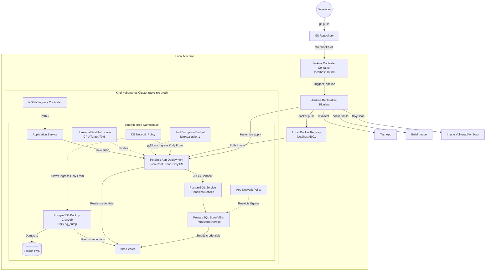

# DevOps Örnek Çalışması: Kubernetes Üzerinde Spring Petclinic

Bu depo, klasik **Spring Petclinic** Java uygulamasını yerel bir Kubernetes (Kind) kümesinde çalıştırmak için gereken altyapı, konfigürasyon dosyaları ve otomasyon betiklerini (PowerShell) barındırır.

Buradaki ana amaç; güvenli konteyner tasarımı, yerel registry entegreli cluster kurulumu, Kustomize ile manifest yönetimi, veritabanı yedekleme cronjob'ları ve Jenkins CI/CD süreçlerini uçtan uca göstermektir.

*İngilizce kılavuz için [README.md](./README.md) dosyasına göz atabilirsiniz.*

---

## Mimari Genel Bakış

Burada yerel ortamın nasıl yapılandırıldığını görebilirsiniz. Docker üzerinde çalışan **Kind (Kubernetes In Docker)** ve yerel registry kullanarak gerçek bir production ortamını simüle ediyoruz.



---

## Dizin Yapısı

```text
.
├── .dockerignore                 # Docker build sırasında gereksiz dosyaları atlar
├── .gitignore                    # Şifrelerin ve derleme çıktılarının git'e gitmesini engeller
├── Jenkinsfile                   # CI/CD Pipeline tanımı
├── app/
│   └── spring-petclinic/         # Spring Boot uygulamasının kaynak kodu
├── docker/
│   └── Dockerfile                # Çok aşamalı (multi-stage) güvenli JRE Dockerfile'ı
├── compose/
│   ├── docker-compose.yml        # K8s dışında local çalıştırma compose dosyası
│   └── jenkins-controller.yml    # Jenkins Controller'ı ayağa kaldıran compose dosyası
├── k8s/
│   ├── kind-cluster.yaml         # Özel Kind cluster konfigürasyonu (Port yönlendirmeleriyle)
│   └── base/                     # Kubernetes Manifestoları (Kustomize Base)
│       ├── namespace.yaml        # Pod Security Standards (PSS) aktif prod namespace
│       ├── kustomization.yaml    # Tüm kaynakları birleştiren kustomize dosyası
│       ├── resourcequota.yaml    # Namespace içi kaynak limitleri
│       ├── limitrange.yaml       # Varsayılan container request/limit ayarları
│       ├── configmap.yaml        # Uygulama konfigürasyonları
│       ├── app-deployment.yaml   # Sıkılaştırılmış güvenli deployment tanımı
│       ├── app-service.yaml      # Uygulama servisi
│       ├── app-ingress.yaml      # Ingress kuralları
│       ├── app-hpa.yaml          # Autoscaler tanımı
│       ├── app-pdb.yaml          # PodDisruptionBudget (kesintisiz çalışma garantisi)
│       ├── app-networkpolicy.yaml# Uygulama için network kısıtları
│       ├── postgres-service.yaml # Headless veritabanı servisi
│       ├── postgres-statefulset.yaml # PostgreSQL StatefulSet tanımı
│       ├── postgres-networkpolicy.yaml # Veritabanı network kısıtları
│       ├── postgres-backup-pvc.yaml # Veritabanı yedekleri için disk alanı
│       └── postgres-backup-cronjob.yaml # Her gece çalışan yedekleme cronjob'ı
└── scripts/                      # Otomasyon betikleri (PowerShell)
    ├── init-secrets.ps1          # Rastgele lokal şifreler üretir
    ├── create-cluster.ps1        # Standart Kind kümesi kurar
    ├── create-cluster-with-registry.ps1 # Kind kümesi + lokal registry ağ bağlantısını kurar
    ├── install-ingress.ps1       # NGINX Ingress Controller kurulumu
    ├── install-metrics-server.ps1# Kind için metrics-server kurar ve yamalar
    ├── build-image.ps1           # İmajı derler ve lokal registry'ye pushlar
    ├── deploy-k8s.ps1            # K8s secret'larını yükler, DB şifresini eşitler ve deploy eder
    └── destroy-k8s.ps1           # Sistemleri kapatıp temizleme betiği
```

---

## Öne Çıkan Teknik Özellikler

### 1. Docker Yapılandırması
* **Multi-stage build:** Nihai imaj boyutunu küçük tutmak için derleme aşamasında JDK 21, çalışma zamanında ise sadece JRE 21 kullanıyoruz.
* **Sabitlenmiş İmaj Etiketleri:** Implicit güncellemelerin derlemeyi bozmasını engellemek için `eclipse-temurin:21-jdk-jammy` gibi spesifik etiketler kullandık.
* **Non-Root Kullanıcı:** Konteyner, root yetkileri olmayan `petclinic` kullanıcısı (UID/GID `10001`) altında çalışır.

### 2. Kubernetes Sıkılaştırma
* **Namespace Security (PSS):** Namespace üzerinde `baseline` kuralları zorunlu kılındı ve `restricted` uyarı/denetim politikaları aktif edildi.
* **Güvenli Workload'lar:** Uygulama için root dosya sistemi salt okunur (`readOnlyRootFilesystem: true`) yapıldı, `ALL` kernel yetkileri düşürüldü ve ayrıcalık yükseltme engellendi.
* **Zero Trust NetworkPolicies:** Pod seviyesinde ağ izolasyonu. Uygulama sadece DB ve DNS ile konuşabilir. DB ise sadece Uygulama ve Yedekleme podlarından bağlantı kabul eder.
* **Kendi Kendini İyileştirme & Ölçekleme:** HPA, CPU kullanımı %70'i geçtiğinde otomatik olarak pod sayısını 3'e kadar ölçekler. PDB ise bakım süreçlerinde en az 1 uygulamanın sürekli ayakta kalmasını garanti eder.
* **Zamanlanmış Yedekleme:** Postgres, verilerin kaybolmaması için `StatefulSet` olarak çalışır. Her gece saat 02:00'de çalışan bir `CronJob`, `pg_dump` alarak yedekleri kalıcı diske (PVC) yazar.

### 3. Şifre Yönetimi
* Git üzerinde hiçbir şifre veya hassas bilgi açıkta tutulmaz.
* Scriptler ilk kurulumda `./secrets/` dizini altında git tarafından takip edilmeyen rastgele şifreler üretir.
* Dağıtım sırasında `deploy-k8s.ps1` bu şifreleri K8s secret'larına çevirir ve Postgres veritabanının içindeki şifreyi otomatik olarak bu yeni secret ile eşitler (özellikle PVC'nin zaten dolu olduğu yeniden kurulumlarda hayat kurtarır).

---

## Kurulum Kılavuzu (Yerel Çalıştırma)

Windows üzerinde Docker Desktop (Linux container modunda) ve aşağıdaki araçların kurulu olması gerekir:
* [Kind CLI](https://kind.sigs.k8s.io/)
* [Kubectl CLI](https://kubernetes.io/docs/tasks/tools/)
* PowerShell 7+

### 🚀 Yöntem A: Hızlı Kurulum (Önerilen)
Küme kurulumu, ağ yapılandırmaları, eklentiler, derleme, k8s dağıtımı ve opsiyonel olarak Jenkins sunucusunu tek seferde ayağa kaldırmak için ana dizindeki betiği koşturmanız yeterlidir:
```powershell
.\start-all.ps1
```
Bu betik tüm adımları sırayla işletir, veritabanı şifrelerini senkronize eder ve hazır olduğunda erişim adreslerini ekrana yazar.

### 📋 Yöntem B: Adım Adım Manuel Kurulum
Sürecin arkasında ne döndüğünü anlamak isterseniz, betikleri sırayla çalıştırabilirsiniz:

**Adım 1: Rastgele şifreleri üretin**
```powershell
.\scripts\init-secrets.ps1
```

**Adım 2: Kind kümesini ve lokal registry bağlantısını kurun**
```powershell
.\scripts\create-cluster-with-registry.ps1
```
Bilgisayarınızda `8080->80` ve `8443->443` port eşlemelerine sahip bir Kind kümesi kurar ve onu `localhost:5001` adresindeki local registry'ye bağlar.

**Adım 3: Ingress ve Metrics Server'ı kurun**
```powershell
.\scripts\install-ingress.ps1
.\scripts\install-metrics-server.ps1
```
*Not: install-metrics-server.ps1 betiği TLS doğrulamalarını atlamak için Kind kümesine özel yamalar uygular, aksi takdirde HPA metrikleri okuyamaz.*

**Adım 4: İmajı derleyin ve registry'ye gönderin**
```powershell
.\scripts\build-image.ps1
```

**Adım 5: Kaynakları Kubernetes'e dağıtın**
```powershell
.\scripts\deploy-k8s.ps1
```
Secret'ları oluşturur, Kustomize deployment'ını yapar, DB şifrelerini eşitler ve podların sağlıklı şekilde ayağa kalkmasını bekler.

---

## Jenkins CI/CD Pipeline

Önceden yapılandırılmış Jenkins sunucumuz `./compose/jenkins-controller.yml` altında tanımlıdır.

### 1. Jenkins'i Başlatma
Jenkins sunucusunu başlatmak için:
```powershell
.\scripts\start-jenkins.ps1
```
Bu betik, verilerin kaybolmaması için bilgisayarınızda `C:/jenkins-home` dizinini oluşturur, konteyneri başlatır, arayüzün açılmasını bekler ve ilk giriş için gereken admin şifresini ekrana yazar.

Durdurmak için:
```powershell
.\scripts\stop-jenkins.ps1
```

### 2. Jenkins Agent'ı Bağlama
Pipeline adımları `windows-docker` etiketli bir ajan gerektirir. Yerel makinenizde bu ajanı başlatmak için:
```powershell
.\scripts\start-jenkins-agent.ps1
```
*Not: İlk çalıştırmada Jenkins arayüzünden (`Manage Jenkins` -> `Nodes` -> `windows-docker-agent`) alacağınız benzersiz "Secret Key" değerini girmeniz istenir. Bu anahtar `secrets/jenkins-agent.secret` dosyasına kaydedilir ve sonraki çalıştırmalarda otomatik olarak kullanılır.*

### 3. Pipeline Aşamaları
Tetiklendiğinde `Jenkinsfile` şu adımları çalıştırır:
1. **Tool Check:** Gerekli CLI araçlarının sürümlerini kontrol eder.
2. **Platform Setup (Opsiyonel):** `RUN_PLATFORM_SETUP` parametresi aktifse Ingress ve Metrics Server'ı günceller.
3. **Test Application:** Unit testleri koşturur (`mvnw.cmd clean test`).
4. **Build Image:** Uygulamayı derler ve güvenli Docker imajını hazırlar.
5. **Security Scan:** İmajı Trivy ile tarar (çıktıları `trivy-image-scan.txt` dosyasına yazar ama OS tabanlı genel açılardan dolayı derlemeyi patlatmaz).
6. **Push Image:** İmajı lokal registry'ye pushlar.
7. **Validate Manifests:** Kustomize dry-run ile manifestoları doğrular.
8. **Deploy:** Jenkins credentials'ı geçici dosyalara yazıp K8s secret'ı oluşturur, manifestoları uygular, DB içindeki şifreyi günceller ve rolling update tetikler.
9. **Verify Rollout:** Dağıtımın başarıyla tamamlandığını doğrular.

---

## Erişim Adresleri
* **Petclinic Uygulaması:** [http://localhost:8080](http://localhost:8080)
* **Jenkins Arayüzü:** [http://localhost:18080](http://localhost:18080)

---

## Sistemi Kapatma ve Temizlik
* Sadece Kubernetes üzerindeki uygulamaları silmek ama cluster'ı açık tutmak için:
  ```powershell
  .\scripts\destroy-k8s.ps1
  ```
* Kind kümesini, registry'yi ve tüm kalıcı disk verilerini tamamen silmek için:
  ```powershell
  .\scripts\destroy-k8s.ps1 -DeleteCluster
  ```
